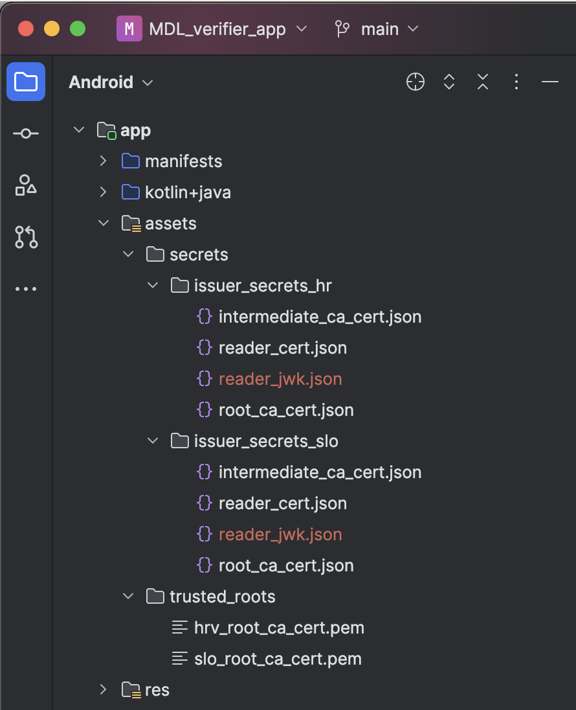
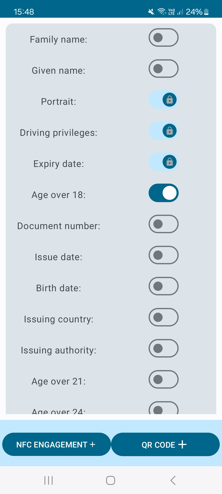
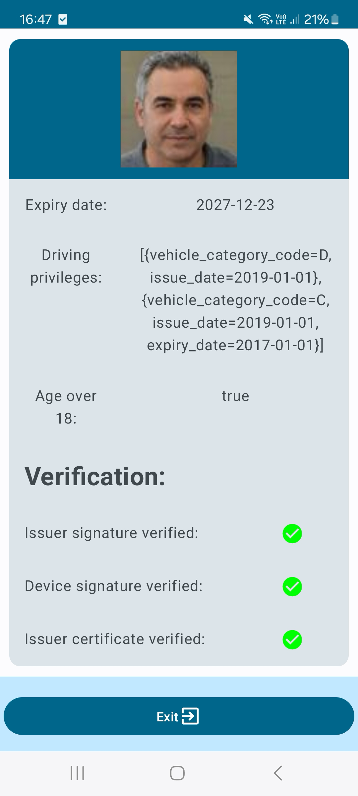
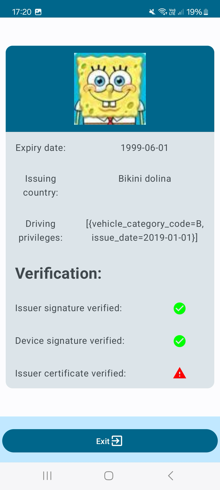

<!-- ABOUT  -->
## About

This folder contines demonstrative Android application used for verifing mobile driving licenses

<!-- GETTING STARTED -->
## Getting Started

Before getting started make sure you have mDL issuing infrastructure set up, so that you can copy the necessary root certificates.

These projects require Android SDK version 33 or above. They were tested using Samsung A72 and Samsung A52.

Running the applications:
  - download <a href="https://developer.android.com/studio">Android Studio</a>. 
  - open project
  - pair/connect Android device with the Android Studio
  - create reader certificate (example in <a href="https://github.com/hrvoje459/mdl_dipl/blob/ded11d676e6418f087bf5e161b05c7f00b4a287e/kotlin_testing/src/main/kotlin/ReaderCreation.kt">kotlin_testing</a>, use root and intermediate certificates created by the middleware issuer application)
  - import trusted root certificates and reader certificate and private key material into the asset folder (structure shown in the picture below)
  - populate <a href="https://github.com/hrvoje459/mdl_dipl/blob/ded11d676e6418f087bf5e161b05c7f00b4a287e/MDL_verifier_app/app/src/main/java/fer/dipl/mdl/mdl_verifier_app/VerifierTransferHelper.kt#L222">hardcoded location</a> of the reader certificate and private key material

  

  

    Asset folder structure  
  

  - Run the application on the device using Android Studio IDE

## Using the application

### Requesting driving license information

When you enter the application you will se a list of toggle buttons, you can flip the toggles to include or exclude information you are requestiong.

User will choose the engagement method and once they present the QR code or NFC scan you should choose the same method and proceed with the engagement.

  

  

    Specifying which information will be requested from the digital wallet  
  

During the engagement, verifier device automatically sends mDL Request to the digital wallet. We are then waiting for the user to approve the request and send the response.

### Verifying driving license information

Once the reponse is received, verifier device conducts necessary verification steps and display status of those checks together with the information presented by the digital wallet.

  
  

  

    Driving license presentation and status checks  
  

