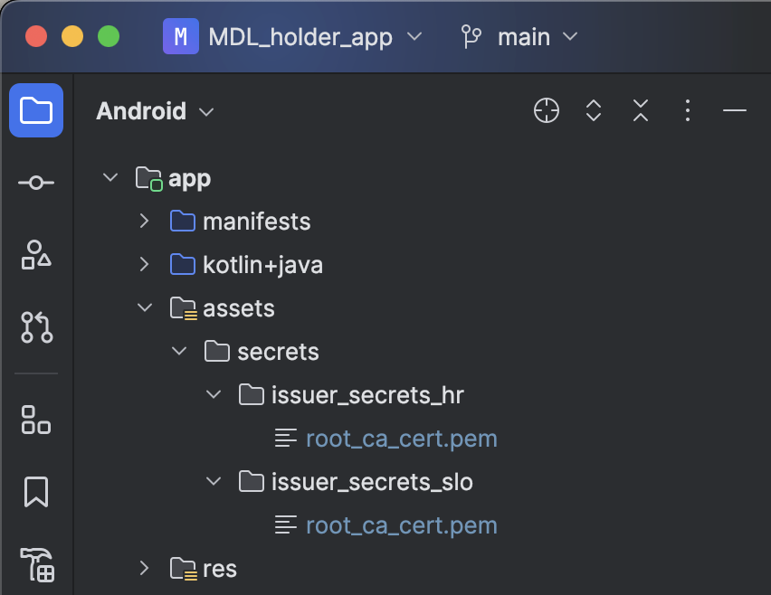
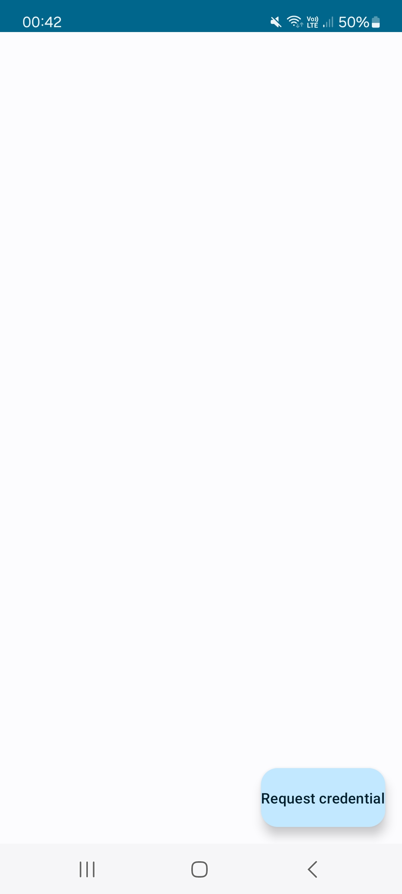
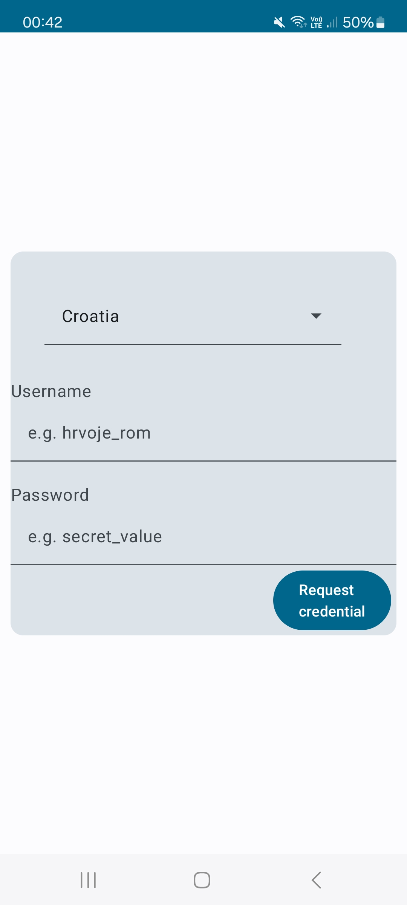
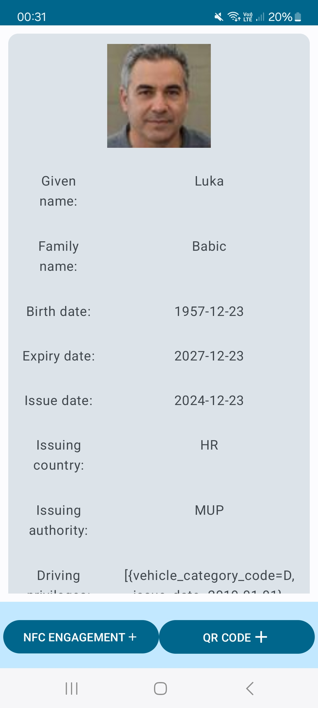
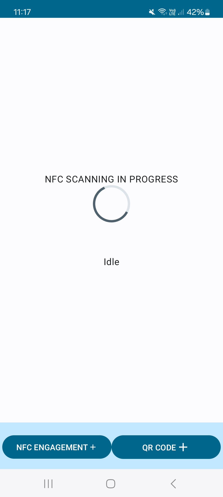
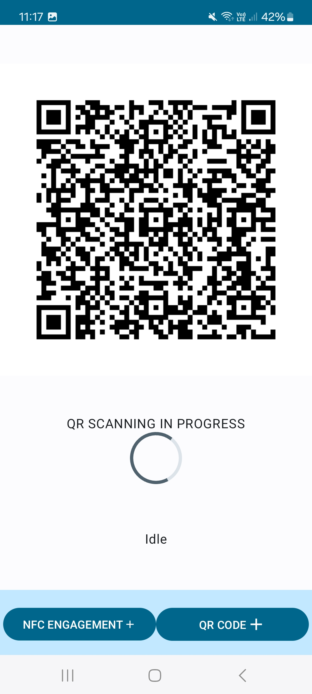
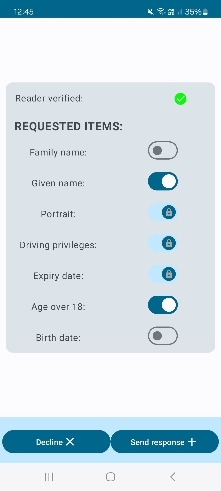

<!-- ABOUT  -->
## About

This folder contains demonstrative Android application for requesting and presenting mobile driving licence

<!-- GETTING STARTED -->
## Getting Started

Before getting started make sure you have mDL issuing infrastructure set up, so that you can copy the necessary root certificates.

These projects require Android SDK version 33 or above. They were tested using Samsung A72 and Samsung A52.

Running the applications:
  - download <a href="https://developer.android.com/studio">Android Studio</a>. 
  - open project
  - pair/connect Android device with the Android Studio
  - import trusted root certificates into the "assets/secrets" folder (root certificates should be all called root_ca_cert.pem and each in its own folder, as shown in the picture below)
  - you need to populate hardcoded <a href="https://github.com/hrvoje459/mdl_dipl/blob/ded11d676e6418f087bf5e161b05c7f00b4a287e/mdl_holder_app/app/src/main/java/fer/dipl/mdl/mdl_holder_app/helpers/DrivingCredentialRequest.kt#L143">list of available credential issuers</a>  and <a href="https://github.com/hrvoje459/mdl_dipl/blob/ded11d676e6418f087bf5e161b05c7f00b4a287e/mdl_holder_app/app/src/main/java/fer/dipl/mdl/mdl_holder_app/activities/RequestCredentialActivity.kt#L79">countries</a> with:
    - client_id - OAuth client ID
    - client_secret - OAuth client secret
    - issuer_backend_url - base URL of our middleware backend application (eg. https://issuer-backend-hrv.mdlissuer.xyz)
    - issuer_api_url - base URL of mDL Issuer (eg. https://issuer-api-hrv.mdlissuer.xyz)
    - idp_url - OAuth resource server issuer URI (eg. https://hrv-idp.mdlissuer.xyz/auth/realms/MDL)

  

  

  

    Asset folder structure  
  

  - Run the application on the device using Android Studio IDE

## Using the application

### Credential issuance

When you first enter the application you will not have driving license issued, pressing the "Request Credential" button will take you to the credential issuance form where you select your country, enter your username and password and request credential. If all the information is correct your mobile driving license will be issued and it will appear in your device.

  
  
  

  

    Credential requesting form and license display
  

After you have your driving license you can start the engagement process (pairing) with the verifier (reader) device by pressing "NFC ENGAGEMENT" or "QR CODE" button.

  
  
  

    Pairing display
  

If you chose NFC engagement you will have to tap the back of the verifier device with the back of your, if you chose engagement via QR code then allow verifier to scan your QR code.

Devices will automatically engage and you will receive request for the information in your driving license, you can verify that the request is valid and you can modify which information will be included in the presentation. Once you are ready you can click "Send response" and, after successfully authentication using your phones built in authentication, the presentation of your driving license will be sent to the verifier

  
  

    Configuring information included in the driving license presentation
  

