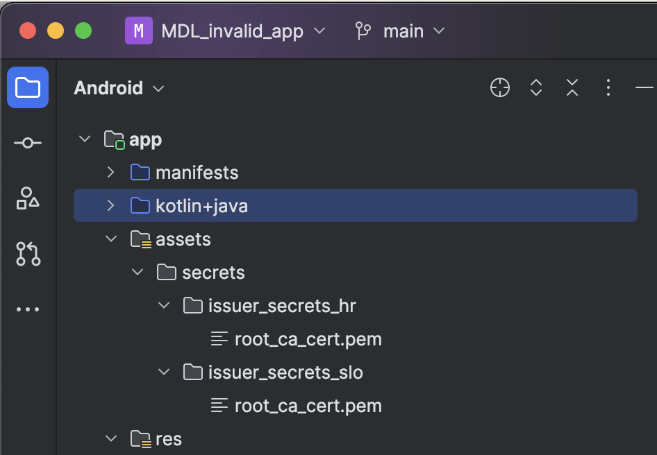
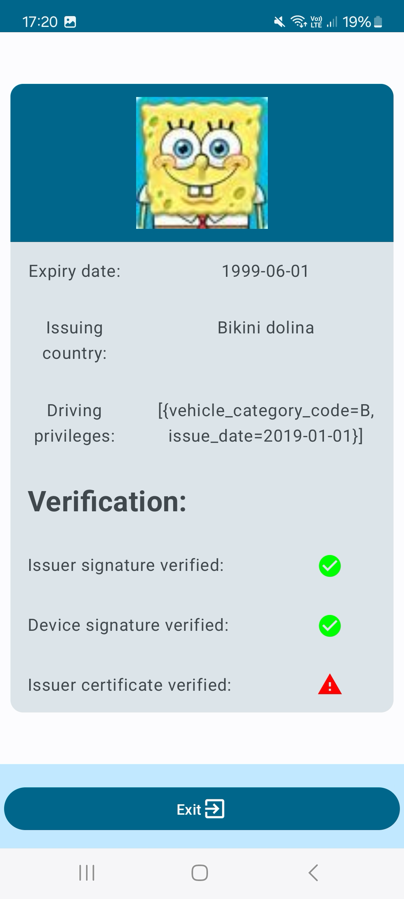

<!-- ABOUT  -->
## About

This folder contains demonstrative Android application used for creating invalid mobile driving license and presenting it to the verifier

<!-- GETTING STARTED -->
## Getting Started

Before getting started make sure you have mDL issuing infrastructure set up, so that you can copy the necessary root certificates.

These projects require Android SDK version 33 or above. They were tested using Samsung A72 and Samsung A52.

Running the applications:
  - download <a href="https://developer.android.com/studio">Android Studio</a>. 
  - open project
  - pair/connect Android device with the Android Studio
  - import trusted root certificates into the asset folder (structure shown in the picture below)
  

  

  

    Asset folder structure  
  

  - Run the application on the device using Android Studio IDE

## Using the application

Insted of requesting actual digital driving license, this application generates its own root certificate and generates mDL document to itself.

Since reader application does not have this root certificate add as a trusted root certificate to its assets folder, it will not recognize the driving license as valid.

Presentation flow is the same is the regular digital wallet application.

  

  

    Invalid driving license presentation and status checks on verifier device  
  

